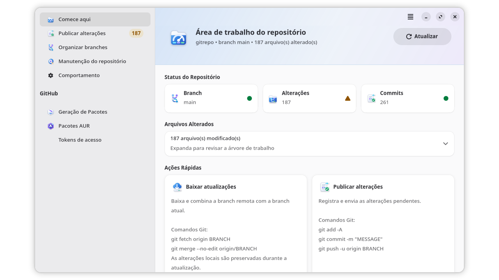
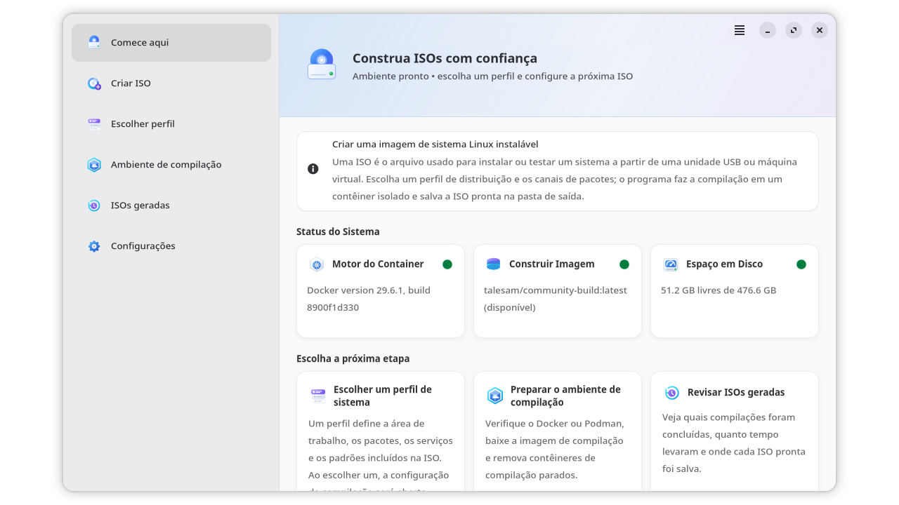

<p align="center">
  
</p>

# GitRepo

**A friendly workspace for publishing Linux packages and building installation images.**

GitRepo brings two jobs that usually involve several terminals, commands, and browser tabs into one focused toolkit. It helps BigCommunity and BigLinux maintainers understand what is happening in a Git repository, publish changes with confidence, start package workflows, and turn distribution profiles into bootable ISO images.

If release day normally means jumping between `git status`, a GitHub Actions page, and a container log, this is where GitRepo becomes genuinely enjoyable: the state is visible, the next action is clear, and you remain in control from beginning to end.

The goal is not to hide Git, GitHub Actions, Docker, or Podman. GitRepo makes those tools easier to follow. The interface shows the repository state, explains important operations, and keeps potentially destructive actions behind explicit confirmation. When automation is more convenient, the same package also provides dedicated command-line entrypoints.

## Two applications, one toolkit

### Build Package



*The repository overview turns the current Git state into clear, practical next steps.*

Build Package is the place to start when a repository is ready for maintenance or release work. It gives you a live overview of the current branch, pending changes, and recent activity before you run an operation.

With it, you can:

- review modified files and the current repository state;
- download and combine remote changes while preserving local work;
- prepare a commit, see the Git commands involved, and publish it;
- create, switch, merge, and clean up branches through guided flows;
- start package workflows for testing, stable, extra, and development channels;
- import a package from the AUR and start its GitHub Actions workflow;
- maintain workflow runs and tags without losing the safety confirmations around destructive operations;
- store GitHub tokens in the system keyring through libsecret.

### Build ISO



*Build ISO checks the environment first, then guides you from a system profile to the generated image.*

Build ISO helps create installation media without turning the build process into a black box. It checks the container runtime, build image, and available disk space, then keeps profiles, package channels, output settings, progress, and previous results in one place.

Watching a distribution profile become a bootable image should feel satisfying, not mysterious. The dashboard makes the prerequisites visible before the build starts and leaves a useful history after it finishes.

With it, you can:

- choose a distribution profile and the editions included in the image;
- configure kernel and package-channel defaults;
- build locally in an isolated Docker or Podman container;
- trigger the configured GitHub Actions workflow from the command line;
- follow build stages, detailed output, cancellation, and cleanup;
- review generated ISOs, duration, status, and output directories;
- reuse cached profile information when the GitHub API is temporarily unavailable.

## Start it your way

GitRepo provides a graphical interface for guided work and a CLI for repeatable terminal workflows:

| Command | Interface | What it opens |
| --- | --- | --- |
| `gitrepo [DIRECTORY]` | GTK | Build Package in the selected Git repository |
| `bpkg [OPTIONS]` | CLI | Package, commit, branch, and AUR workflows |
| `build-iso` | GTK | The Build ISO application |
| `biso [OPTIONS]` | CLI | Remote or local ISO automation |

`gitrepo` accepts at most one directory. When a path is provided, it asks Git for the repository root before opening the application, so launching it from a nested folder works as expected.

Run the graphical applications directly from this checkout with the simplest possible commands:

```bash
cd usr/share/gitrepo/build_package
python main.py
```

```bash
cd usr/share/gitrepo/build_iso
python main.py
```

The launchers under `usr/bin/` also work directly from the checkout because they resolve their own `../share` directory:

```bash
usr/bin/gitrepo .
usr/bin/bpkg --help
usr/bin/build-iso
usr/bin/biso --help
```

The launchers require Bash and delegate to canonical Python modules with `python3 -m`. They preserve the Python process's exit status and signals. `gitrepo` validates an optional directory before GTK starts; the other launchers forward their arguments unchanged.

Use `bpkg --dry-run` to inspect a package or Git operation without changing files or references.

## Install on Arch Linux

```bash
cd pkgbuild
makepkg -si
```

The package installs the applications, command-line launchers, icons, desktop entries, AppStream metadata, translations, and optional actions for Dolphin, Nautilus, Nemo, and Thunar under `/usr`.

### Requirements

- Python 3.10 or newer;
- Git;
- GTK 4, Libadwaita, and PyGObject;
- Python Requests and Rich;
- libsecret for protected GitHub credential storage;
- `xdg-open` for generated files and directories;
- Docker or Podman for local ISO builds;
- `makepkg` when Build Package reads Arch package metadata.

The Arch package declares the exact runtime dependencies. Docker, Podman, desktop notifications, and file-manager integrations are optional where their corresponding workflow is not used.

## Designed to be understandable and safe

GitRepo favors visible operations over surprising automation:

- destructive Git actions require confirmation;
- subprocesses receive explicit argument lists instead of assembled shell commands;
- invalid settings are reported instead of being silently replaced;
- settings and build history are written atomically;
- local and remote build steps report progress and actionable failures;
- GitHub tokens are stored by libsecret rather than in the repository.

Legacy cleartext token files are removed only after a verified keyring write. Build ISO can import its former CLI and GUI settings when the canonical configuration does not exist, while leaving the legacy source untouched.

## User data

GitRepo follows the XDG directory conventions:

| Data | Default location |
| --- | --- |
| Build ISO settings | `${XDG_CONFIG_HOME:-~/.config}/gitrepo/build-iso.json` |
| Build ISO history | `${XDG_CONFIG_HOME:-~/.config}/gitrepo/build-iso-history.json` |
| Build Package settings | `${XDG_CONFIG_HOME:-~/.config}/gitrepo/` |
| Logs and runtime diagnostics | `${XDG_STATE_HOME:-~/.local/state}/gitrepo/` |

## Languages

The graphical applications, command-line interfaces, desktop entries, and file-manager actions are prepared for 29 languages. Gettext catalogs live in `locale/`, while the compiled runtime catalogs are installed below `usr/share/locale/`.

## Project structure

```text
usr/bin/                         four small Bash launchers
usr/lib/gitrepo/                 shared Bash launcher helper
usr/share/gitrepo/common/        shared, product-neutral Python code
usr/share/gitrepo/build_package/ Build Package CLI, core, GTK, and main.py
usr/share/gitrepo/build_iso/     Build ISO CLI, core, GTK, and main.py
usr/share/gitrepo/icons/         flat private GTK icon catalog
usr/share/icons/hicolor/         desktop application icons
usr/share/locale/                compiled runtime translations
locale/                          gettext PO sources and POT template
docs/images/                     screenshots used by this README
tests/                           contract and regression tests
pkgbuild/PKGBUILD                Arch Linux package recipe
```

## Development

Run the focused quality gates from the repository root:

```bash
ruff format --check usr/share tests
ruff check usr/share tests
PYTHONPATH="$PWD/usr/share" pytest -q
```

Build the Arch package with:

```bash
cd pkgbuild
makepkg
```

## License

GitRepo is free software released under the MIT License. See [LICENSE](LICENSE).
