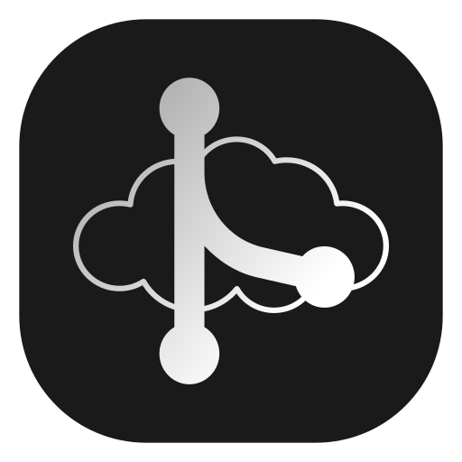
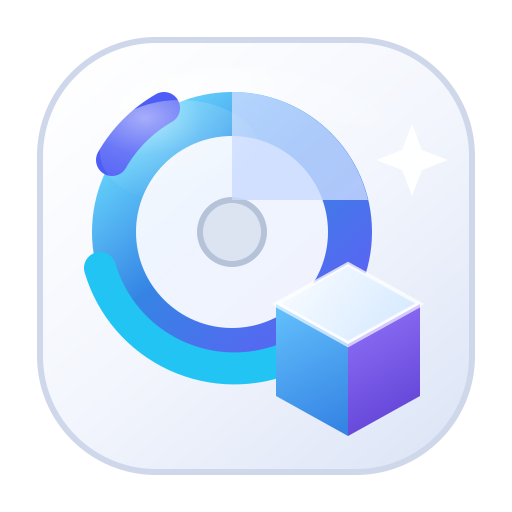
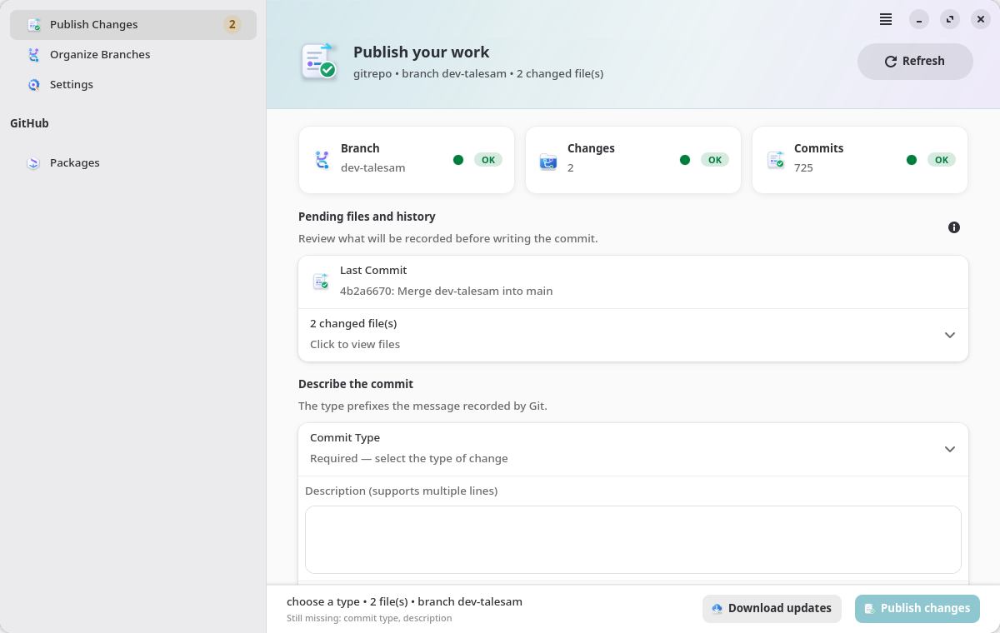
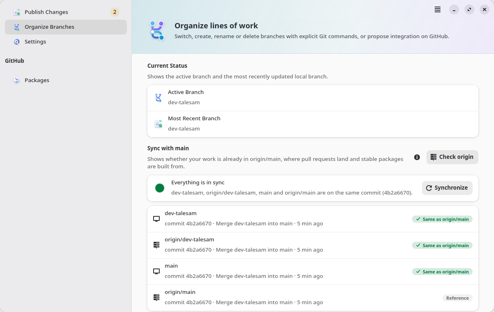
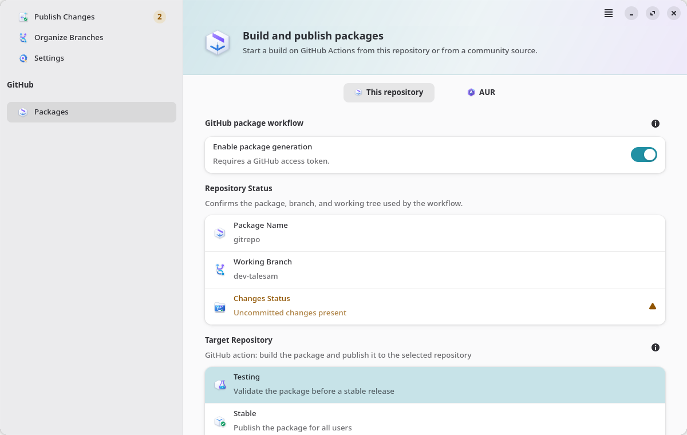
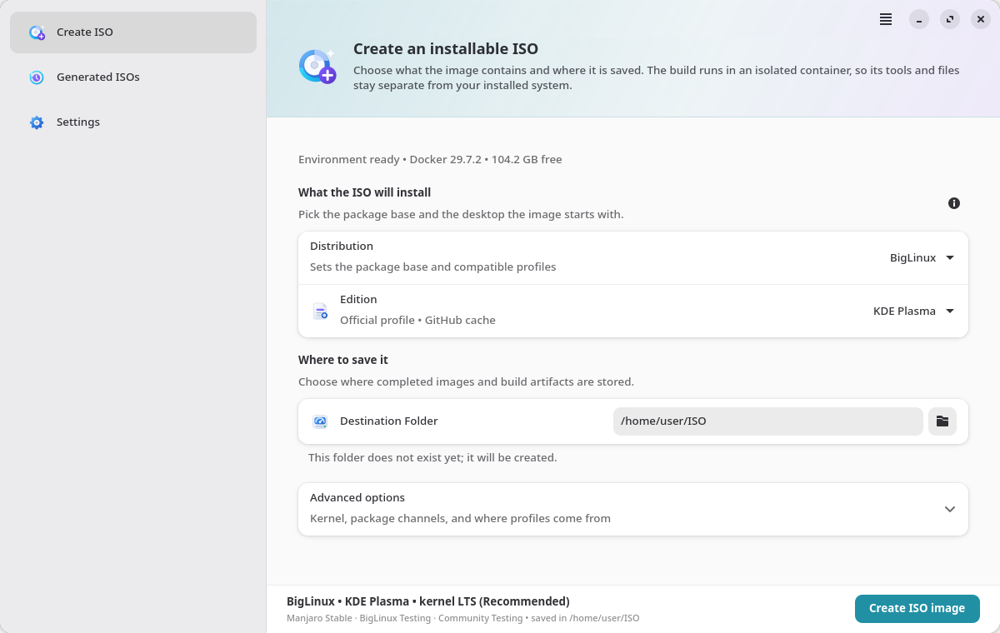
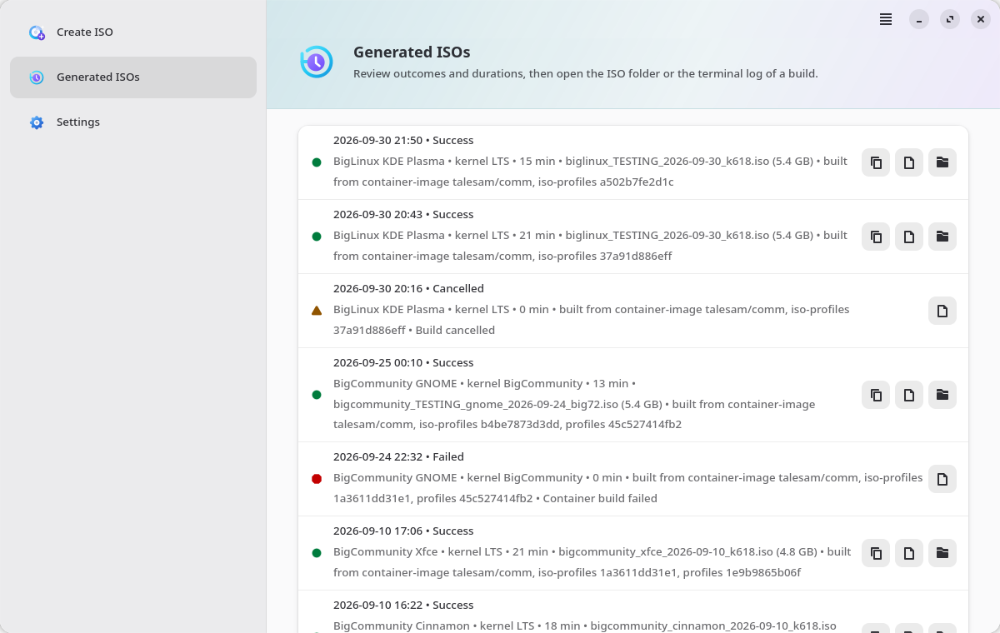
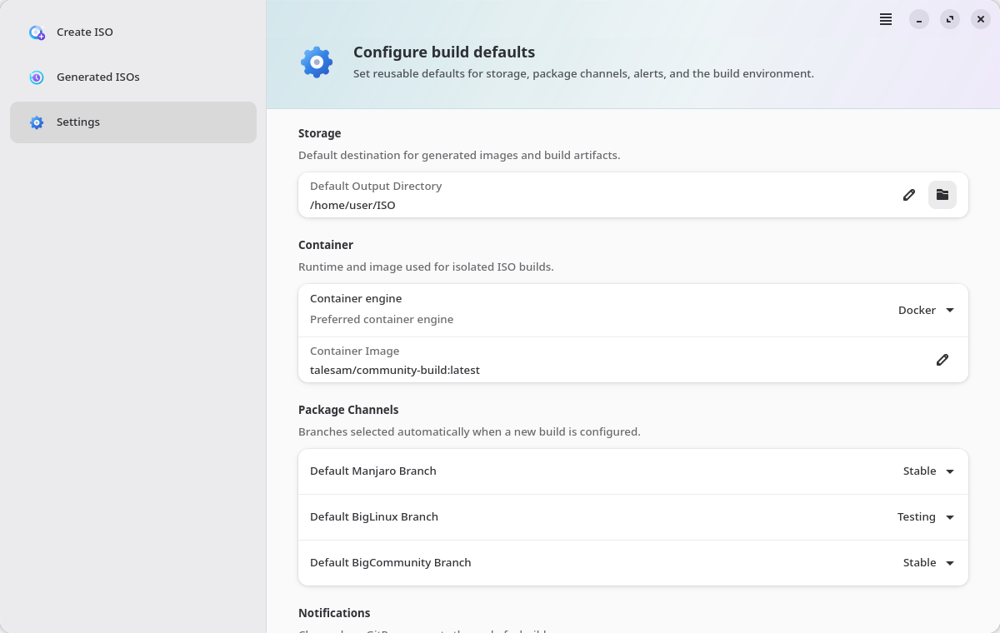

<p align="center">
  
  &nbsp;&nbsp;&nbsp;
  
</p>

<h1 align="center">GitRepo</h1>

<p align="center">
  <strong>A friendly workspace for publishing Linux packages and building installation images.</strong><br>
  Made for BigCommunity and BigLinux maintainers.
</p>

GitRepo brings two jobs that usually involve several terminals, commands, and browser tabs into one focused toolkit:

- **Build Package** (`gitrepo`, `bpkg`) shows what is happening in a Git repository, publishes your changes, keeps your branch in step with `main`, and starts package workflows on GitHub Actions.
- **Build ISO** (`build-iso`, `biso`) turns a distribution profile into a bootable ISO image, locally in a container or remotely on GitHub Actions.

GitRepo does not hide Git, GitHub Actions, Docker, or Podman. It makes them easier to follow. Every screen states the repository's current state in plain words, every operation shows the commands it is about to run, and anything that publishes or discards work asks first.

## Build Package



*Publish Changes: the branch, the pending files, and the commit you are about to write, side by side.*

Build Package is where release work starts. Open it in a repository and it shows the current branch, the pending changes, and the latest commit before you touch anything.

<table>
  <tr>
    <td width="50%"></td>
    <td width="50%"></td>
  </tr>
  <tr>
    <td><em>Organize Branches: whether your work is already in <code>origin/main</code>, and one button to bring every copy up to date.</em></td>
    <td><em>Packages: start a testing, stable, or extra build on GitHub Actions, or import a package from the AUR.</em></td>
  </tr>
</table>

With it, you can:

- review modified files and publish a typed commit, with an automatic version bump when you want one;
- download remote changes while keeping your local work, and resolve conflicts through guided choices;
- **see whether your branch is in `main`**: your branch and `main`, on this computer and on GitHub, each compared with `origin/main`;
- **synchronize after a pull request**: one click fetches `origin` and brings your branch, its copy on GitHub, and your local `main` to the same commit. It only fast-forwards; nothing is merged, and commits that exist only in your local `main` are kept in a backup branch first;
- create, switch, rename, delete, and clean up branches, and open pull requests, with an optional auto-merge that synchronizes afterwards;
- start package workflows for the testing, stable, and extra repositories, or build a package straight from the AUR;
- clean up workflow runs and tags behind explicit confirmations;
- keep GitHub tokens in the system keyring through libsecret.

## Build ISO



*Create ISO: choose the distribution, the desktop edition, and where the image is saved; the build runs in an isolated container.*

Build ISO creates installation media without turning the build into a black box. It checks the container engine, the build image, and the free disk space before you start, then keeps profiles, package channels, progress, and past results in one place.

<table>
  <tr>
    <td width="50%"></td>
    <td width="50%"></td>
  </tr>
  <tr>
    <td><em>Generated ISOs: the outcome, duration, size, and exact sources of every build, with its folder and terminal log.</em></td>
    <td><em>Settings: output folder, container engine and image, and the default package channels.</em></td>
  </tr>
</table>

With it, you can:

- choose BigCommunity or BigLinux, the desktop edition, and the kernel;
- pick the Manjaro, BigLinux, and BigCommunity package channels, including community-testing for BigLinux images;
- build locally in an isolated Docker or Podman container, or trigger the GitHub Actions workflow;
- follow build stages and detailed output, cancel a build, and clean up afterwards;
- review generated ISOs with their duration, status, size, and the container image and profiles they came from;
- keep working from cached profile information when the GitHub API is temporarily unavailable.

## A typical release day

1. Open `gitrepo .` in the package repository. **Publish Changes** shows what changed; pick a commit type, describe it, and publish to your `dev-*` branch.
2. Build a **testing** package from the **Packages** page and try it.
3. When it is ready, either open a pull request from **Organize Branches**, or build a **stable** package, which publishes your branch as `main` for you.
4. Back in **Organize Branches**, *Sync with main* should read *Everything is in sync*. If it says *Your work is already in main*, click **Synchronize** and your branch, its copy on GitHub, and your local `main` all move to the same commit.

## Start it your way

| Command | Interface | What it opens |
| --- | --- | --- |
| `gitrepo [DIRECTORY]` | GTK | Build Package in the selected Git repository |
| `bpkg [OPTIONS]` | CLI | Package, commit, branch, and AUR workflows |
| `build-iso` | GTK | The Build ISO application |
| `biso [OPTIONS]` | CLI | Remote or local ISO automation |

`gitrepo` accepts at most one directory. When a path is given, it asks Git for the repository root first, so launching it from a nested folder works as expected.

Some terminal examples:

```bash
bpkg                                   # interactive menu (includes "Sync with main")
bpkg --commit "fix: handle empty input" # commit and push
bpkg --commit-only --commit "wip"      # commit locally, publish later
bpkg --build dev                       # commit, push, and build a package
bpkg --aur google-chrome               # build a package from the AUR
bpkg --dry-run                         # show what would run, change nothing

biso                                   # interactive menu
biso --local --distro biglinux --edition kde --kernel lts
biso --auto --distro bigcommunity --edition gnome
```

Run `bpkg --help` and `biso --help` for every option.

### From a source checkout

The launchers under `usr/bin/` resolve their own `../share` directory, so they work directly from a clone:

```bash
usr/bin/gitrepo .
usr/bin/bpkg --help
usr/bin/build-iso
usr/bin/biso --help
```

They require Bash and delegate to the Python modules with `python3 -m`, preserving the exit status and signals. `gitrepo` validates its optional directory before GTK starts; the other launchers forward their arguments unchanged.

## Install on Arch Linux

```bash
cd pkgbuild
makepkg -si
```

The package installs the applications, command-line launchers, icons, desktop entries, AppStream metadata, translations, and optional actions for Dolphin, Nautilus, Nemo, and Thunar under `/usr`.

### Repository emblems

Nautilus (`nautilus-python`) and Nemo (`nemo-python`) show circular GitRepo emblems on repository-root folders:

| Emblem | State |
| --- | --- |
| Gray branch | Clean working tree; no known pending publication |
| Orange pencil | Modified, staged, deleted, or untracked files |
| Blue arrow | Local commits pending publication |
| Red exclamation mark | Unresolved conflicts |

Priority: conflicts, local changes, pending publication, clean. Ordinary folders and non-root subfolders receive no emblem. Linked worktrees and submodule roots are supported.

Status refreshes in batches through a separate process every five seconds while folder objects remain in the file manager. Recent results stay cached for five minutes, so revisiting folders shows their emblems immediately while refreshing. Queries use local Git data, never fetch, and do not refresh the index. Ignored files do not mark a repository as modified. Failed queries clear the emblem instead of reporting a clean repository. Remote state reflects the last fetch or push; a clean emblem does not guarantee that the server has no newer commits.

In Nautilus's grid view, GitRepo emblems keep their full colors instead of inheriting the host's dimming. Their size is unchanged; unrelated emblems keep their original dimming.

Install the matching Python extension package and restart the file manager after upgrading GitRepo. The host file manager controls emblem placement. Dolphin and Thunar keep their context-menu integration; the Python emblem providers target Nautilus and Nemo.

### Requirements

- Python 3.10 or newer;
- Git;
- GTK 4, Libadwaita, and PyGObject;
- Python Requests and Rich;
- libsecret for protected GitHub credential storage;
- `xdg-open` for generated files and directories;
- Docker or Podman for local ISO builds;
- `makepkg` when Build Package reads Arch package metadata.

The Arch package declares the exact runtime dependencies. Docker, Podman, desktop notifications, and file-manager integrations are optional when their workflow is not used.

## Designed to be understandable and safe

GitRepo favors visible operations over surprising automation:

- every Git operation shows its commands before it runs;
- destructive Git actions require confirmation, and deleting a branch says how many commits would be lost;
- commits that exist only in your local `main` are kept in a backup branch before `main` is realigned;
- synchronization only fast-forwards; merges happen only when you ask for them;
- subprocesses receive explicit argument lists instead of assembled shell commands;
- invalid settings are reported instead of being silently replaced;
- settings and build history are written atomically;
- local and remote build steps report progress and actionable failures;
- GitHub tokens are stored by libsecret rather than in the repository.

Legacy cleartext token files are removed only after a verified keyring write. Build ISO can import its former CLI and GUI settings when the canonical configuration does not exist, leaving the legacy source untouched.

## User data

GitRepo follows the XDG directory conventions:

| Data | Default location |
| --- | --- |
| Build ISO settings | `${XDG_CONFIG_HOME:-~/.config}/gitrepo/build-iso.json` |
| Build ISO history | `${XDG_CONFIG_HOME:-~/.config}/gitrepo/build-iso-history.json` |
| Build Package settings | `${XDG_CONFIG_HOME:-~/.config}/gitrepo/` |
| Logs and runtime diagnostics | `${XDG_STATE_HOME:-~/.local/state}/gitrepo/` |

## Languages

The graphical applications, command-line interfaces, desktop entries, and file-manager actions are translated into 29 languages. Gettext catalogs live in `locale/`; the compiled runtime catalogs are installed below `usr/share/locale/`.

## Project structure

```text
usr/bin/                         four small Bash launchers
usr/lib/gitrepo/                 shared Bash launcher helper
usr/share/gitrepo/common/        shared, product-neutral Python code
usr/share/gitrepo/build_package/ Build Package CLI, core, and GTK interface
usr/share/gitrepo/build_iso/     Build ISO CLI, core, and GTK interface
usr/share/gitrepo/file_manager/  repository status for the file-manager emblems
usr/share/gitrepo/icons/         flat private GTK icon catalog
usr/share/icons/hicolor/         application icons and emblems
usr/share/locale/                compiled runtime translations
locale/                          gettext PO sources and POT template
docs/images/                     icons and screenshots used by this README
tests/                           contract and regression tests
pkgbuild/PKGBUILD                Arch Linux package recipe
```

## Development

Run the quality gates from the repository root:

```bash
ruff format --check usr/share tests
ruff check usr/share tests
PYTHONPATH="$PWD/usr/share" pytest -q
```

Build the Arch package with:

```bash
cd pkgbuild
makepkg
```

## License

GitRepo is free software released under the MIT License. See [LICENSE](LICENSE).
